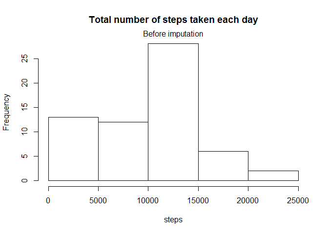
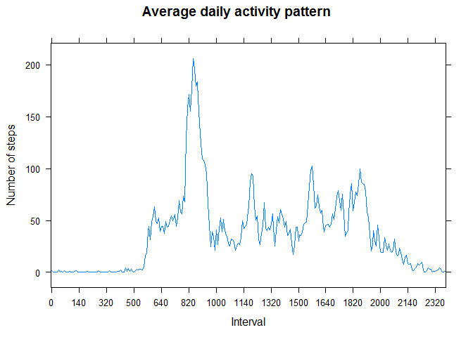
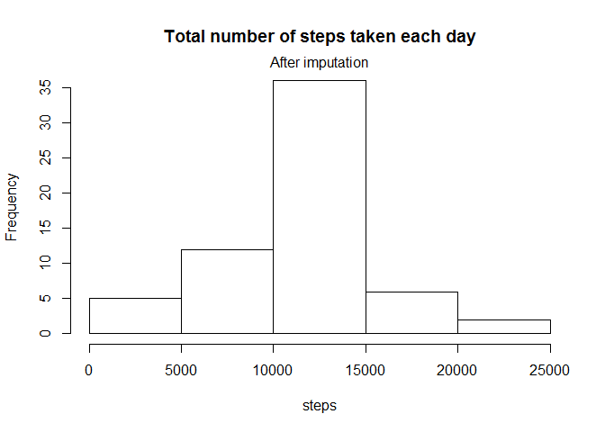
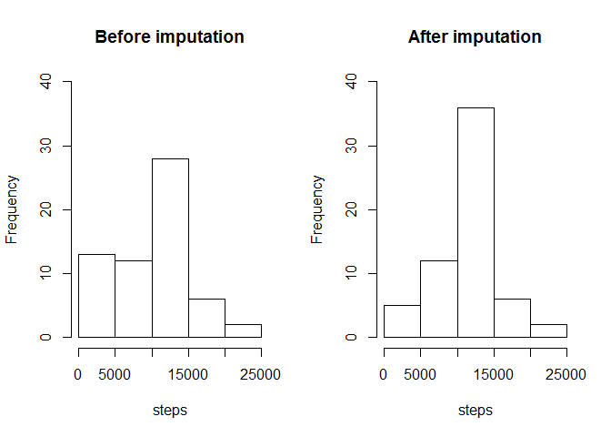
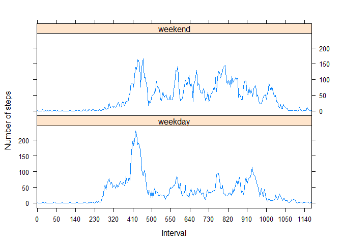

# Reproducible Research - Assignment 1
piolivie  
Friday, March 11, 2016  

## Init environment

```
## 
## Attaching package: 'dplyr'
```

```
## The following objects are masked from 'package:stats':
## 
##     filter, lag
```

```
## The following objects are masked from 'package:base':
## 
##     intersect, setdiff, setequal, union
```

## Loading and preprocessing the data


```r
### Download and unzip file 
url <- "https://github.com/piolivie/RepData_PeerAssessment1/blob/master/activity.zip";
dest <-"activity.zip";
if(!file.exists(dest)){
  download.file(url, destfile= dest)
  unzip(dest) 
}

### Load the data
if(!exists("activity")){activity <- read.csv("activity.csv", na.strings="NA")}

### Transform into a format suitable for analysis
activity$date <- as.Date(activity$date,"%Y-%m-%d")
activity$interval <- as.factor(activity$interval)
```

## What is the mean and median number of steps taken per day?


```r
### total number of steps taken per day (ignore missing values)
by_date <- group_by(activity, date)  
actitivy_grouped_date<-summarize(by_date, steps=sum(steps,na.rm=TRUE)) 

### histogram of the total number of steps taken each day
hist(actitivy_grouped_date$steps, xlab="steps",main="Total number of steps taken each day")
mtext("Before imputation")
```



```r
### mean and median of the total number of steps taken per day
summary(actitivy_grouped_date$steps)
```

```
##    Min. 1st Qu.  Median    Mean 3rd Qu.    Max. 
##       0    6778   10400    9354   12810   21190
```

## What is the average daily activity pattern?

* Average daily activity pattern:

```r
### Time series plot (i.e. type = "l") of the 5-minute interval (x-axis) 
### and the average number of steps taken, averaged across all days (y-axis)
by_interval <- group_by(activity, interval)  
actitivy_grouped_interval<-summarize(by_interval, mean_steps=mean(steps,na.rm=TRUE)) 

## calculate position and create labels
at <- seq(1, nrow(actitivy_grouped_interval), by=20)
labels <- actitivy_grouped_interval$interval[at]
par(mfrow=c(1,1))
xyplot(mean_steps ~ interval, 
       data = actitivy_grouped_interval, 
       type="l",
       layout = c(1, 1),
       main="Average daily activity pattern",
       xlab="Interval",   
       ylab="Number of steps",       
       scales=list(x=list(at=at,labels=labels ))       
)
```




```r
## Which 5-minute interval, on average across all the days in the dataset, contains the maximum number of steps?
max_steps<-max(actitivy_grouped_interval$mean_steps);
interval_max_steps<-actitivy_grouped_interval[actitivy_grouped_interval$mean_steps==max_steps,]$interval
```
* Interval 835 contains the maximum number of steps.

## Imputing missing values

*Note that there are a number of days/intervals where there are missing values (coded as NA).*
*The presence of missing days may introduce bias into some calculations or summaries of the data.*


```r
### Calculate and report the total number of missing values in the dataset (i.e. the total number of rows with NAs)
na_count<-as.numeric(sum(!complete.cases(activity$steps,activity$date,activity$interval)))
```

* There are  2304 rows with missing values in the dataset.


```r
### Fill in missing values with the mean for that 5-minute interval. 
actitivy_impute_steps<-summarize(by_interval, mean_steps=mean(steps,na.rm=TRUE)) 
actitivy_imputed <- left_join(activity, actitivy_impute_steps)
```

```
## Joining by: "interval"
```

```r
actitivy_imputed$steps <- ifelse (is.na(actitivy_imputed$steps), actitivy_imputed$mean_steps, actitivy_imputed$steps)

### total number of steps taken per day (ignore missing values)
by_date_imputed <- group_by(actitivy_imputed, date)  
actitivy_imputed_grouped_date<-summarize(by_date_imputed, steps=sum(steps,na.rm=TRUE)) 
```

* Histogram of the total number of steps taken each day (after imputation)

```r
### histogram of the total number of steps taken each day (after imputation)
hist(actitivy_imputed_grouped_date$steps, xlab="steps",main="Total number of steps taken each day")
mtext("After imputation")
```



* Mean and median of the total number of steps taken per day (after imputation)

```r
### mean and median of the total number of steps taken per day
summary(actitivy_imputed_grouped_date$steps)
```

```
##    Min. 1st Qu.  Median    Mean 3rd Qu.    Max. 
##      41    9819   10770   10770   12810   21190
```

* These values differ from the estimates (before imputation), as illustrated below.

```r
### Do these values differ from the estimates from the first part of the assignment?
summary(actitivy_grouped_date$steps)
```

```
##    Min. 1st Qu.  Median    Mean 3rd Qu.    Max. 
##       0    6778   10400    9354   12810   21190
```

* The distribution of the number of steps after imputation is "less" skewed and corresponds better to a normal distribution.

```r
## What is the impact of imputing missing data on the estimates of the total daily number of steps?
## The distribution of the number of steps is "less" skewed, corresponds better to a normal distribution
par(mfrow=c(1,2))
hist(actitivy_grouped_date$steps, main="Before imputation",xlab="steps", ylim=c(0,40))
hist(actitivy_imputed_grouped_date$steps, main="After imputation",xlab="steps",ylim=c(0,40))
```



## Differences in activity patterns between weekdays and weekends.


```r
### Create weekend indicator 'type' (i.e. factor variable with values "weekend" and "weekday")
actitivy_imputed$weekday<-weekdays(actitivy_imputed$date)
actitivy_imputed$wday<-as.POSIXlt(actitivy_imputed$date)$wday
actitivy_imputed$daytype <- ifelse (actitivy_imputed$wday %in% c(0,6), "weekend","weekday")
actitivy_imputed$daytype <- as.factor(actitivy_imputed$daytype)

### Group imputed dataset by interval and daytype to create dataset needed by plot
by_interval_imputed <- group_by(actitivy_imputed, interval,daytype)  
actitivy_grouped_interval_imputed<-summarize(by_interval_imputed, mean_steps=mean(steps,na.rm=TRUE)) 

### Plot
par(mfrow=c(1,1))
at <- seq(1, nrow(actitivy_grouped_interval_imputed), by=20)
labels <- actitivy_grouped_interval_imputed$interval[at]
xyplot(mean_steps ~ interval | daytype, 
       data = actitivy_grouped_interval_imputed, 
       type="l",
       layout = c(1, 2),
       xlab="Interval",   
       ylab="Number of steps",       
       scales=list(x=list(at=at,labels=labels ))        
       )
```



* There are differences in activity patterns between weekdays and weekends. During the week stepping starts earlier and during the weekend there is more activity at the end.
